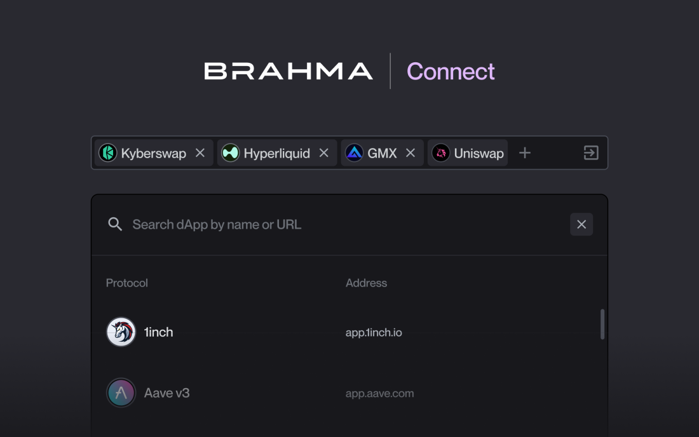

# <h1 align="center">  </h1>

# Brahma Connect

Brahma Connect is a chained execution framework designed to enhance the interaction experience with decentralized applications (dApps) across EVM chains. Utilizing a Chrome extension, Brahma Connect integrates dApps within an iframe, allowing users to securely interact with multiple dApps at once from their Brahma [Console's Safe wallet](https://www.brahma.fi/). This capability is powered by a suite of forked nodes, which facilitate the propagation of dApp states through a simulation mode, enhancing security and user experience. Brahma connect works specifically in tandem with Brahma Console and its execution stack, as its primary dApp connection method.
Users can build sequences of actions across dApps in a single session, and batch them all in a single transaction. This enables user to save time, gas and have better control on their strategies being executed in a single transaction and block.
This approach simplifies the process of interacting with multiple dApps, streamlining operations and improving user efficiency and costs.

## Key Features

- **Chained Execution:** Facilitates the sequential execution of transactions across different dApps, reducing the complexity and time required for multi-step operations.
- **IFrame Integration:** securely embeds dApps within an iframe, upholding the dApp's integrity, while the extension intercepts transactions and synchronizes the dApp's state using forked nodes, facilitating efficient transaction batching.

## Security Assumptions

Brahma Connect is built with a strong emphasis on security, notably eliminating the need for private key management directly within the extension. The framework ensures that users maintain full control over their assets without exposing sensitive information. Brahma Connect enhances security through a forked node that communicates with dApps via extensions using the chrome runtime, enabling users to preview and simulate transactions safely before confirming and sending them.

# Installation

While the Brahma Connect extension undergoes the Chrome Web Store publishing process, we are releasing a beta version of Brahma Connect on Blast L2 chain, which requires manual installation. Once the official extension is published, users will be able to install it directly from its Chrome Web Store page.

## How to install the built extension manually

1. Download the extension from this Github repo **\_\_\_\_**
2. At the bottom, under Assets, click on the zip file, to download it
3. Open the Extension Management page by navigating to [chrome://extensions](chrome://extensions).
4. Enable **Developer Mode** by clicking the toggle switch at the top right of the page.
5. Click the **Load unpacked** button and select the `./public` folder to install a local build. To install a downloaded build, unpack the downloaded `.zip` file and select it.

# Using Brahma Connect

1. Once the extension is installed, head to your Brahma Console at the usual link https://console.brahma.fi/
2. You will see a new tab in the menu sidebar called "Brahma Connect"
3. Now you can search and load any dApp URL directly in your Console and leverage the Console stack with transaction chaining, simulation and relayer for best execution

# Contribution

## How to build extension locally

1. Run
   ```
   yarn
   ```
2. For a development build, run -
   ```
   yarn dev
   ```
   For a production build, run -
   ```
   yarn build
   ```

## Credits

Brahma Connect's design incorporates a specific approach pioneered by the Gnosis Guild Team through their Zodiac Pilot product, focusing on recording users' transactions for a more streamlined and efficient interaction with dApps. This methodology has been pivotal in developing Brahma Connect's execution framework, enabling a more cohesive and user-friendly experience.

For more information, visit https://github.com/gnosisguild/zodiac-pilot

## License

[MIT](LICENSE) © [Brahma-fi](https://github.com/Brahma-fi)
